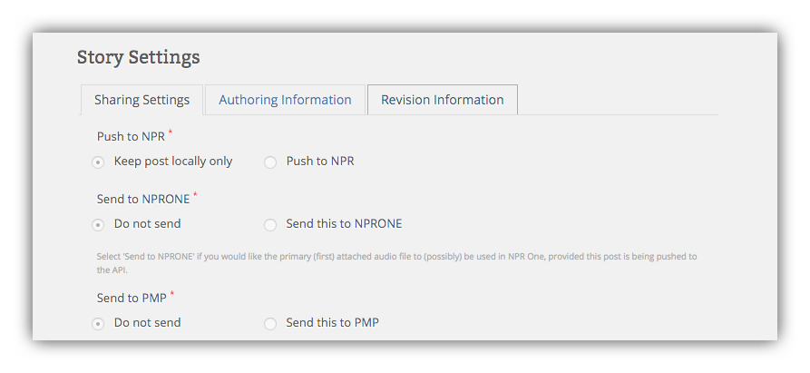

# Pushing Stories to the Public Media Platform

Pushing your stories to the PMP couldn't be easier. Just like with Pushing to NPR, and sending a story to NPR One, Core Publisher provides a button to **Send to PMP**:

By default "Do not send" is selected, so if you want to push the story to the PMP select "Send this to PMP". When you hit Publish, the story will push to the PMP.

Note that you can only push stories you author to the PMP. Content pulled from the NPR API or the PMP can be displayed on your Core Publisher site, but can't be pushed from it.